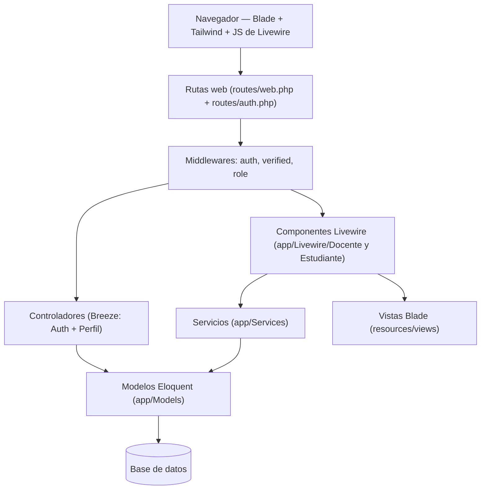

# Arquitectura

> Documentación generada a partir de la estructura de `app/`, `routes/`, `config/` y `resources/`.
> Última actualización: 2026-10-01.

## Contenido

1. [Patrones de diseño](#1-patrones-de-diseño)
2. [Controladores, middlewares y rutas](#2-controladores-middlewares-y-rutas)
3. [Frontend y vistas integradas](#3-frontend-y-vistas-integradas)
4. [Estructura de carpetas](#4-estructura-de-carpetas)
5. [Registro de decisiones de diseño](#5-registro-de-decisiones-de-diseño)
6. [Observaciones](#6-observaciones)

---

## 1. Patrones de diseño

El proyecto sigue el **MVC de Laravel** con una capa de **servicios** para la lógica de negocio y una capa de presentación basada en **componentes Livewire** en lugar de controladores tradicionales.



Capas y cómo se relacionan:

- **Presentación**: componentes Livewire (`app/Livewire/Docente/*`, `app/Livewire/Estudiante/*`) que exponen propiedades públicas y acciones `wire:*`. Las vistas Blade correspondientes viven en `resources/views/components/docente/` y `.../estudiante/`. Los controladores HTTP **no** participan en el flujo de negocio: solo cubren autenticación (Breeze) y perfil de usuario.
- **Lógica de negocio (Service Layer)**: `app/Services/` con tres servicios concretos:
  - `AsistenciasService`: estado de asistencia por fecha, guardado masivo (upsert) e historial semestral.
  - `CalificacionesService`: matriz de notas, creación/eliminación de evaluaciones, guardado transaccional de notas y cálculo de notas finales ponderadas.
  - `GrupoEstudiantesService`: búsqueda de estudiantes registrados, alta y baja en un grupo (pivote `grupo_estudiante`).
  - Los servicios se resuelven en los componentes con `app(Servicio::class)` (contenedor de dependencias). **No hay interfaces ni repositorios**: no existe patrón Repository ni inyección constructora; los servicios consultan los modelos Eloquent directamente y usan `DB::transaction` para escrituras multi-paso.
- **Modelos**: Eloquent (`app/Models/`), con relaciones y helpers propios (ver `docs/base_datos.md`).
- **Autenticación y autorización**: Breeze (estarter kit) + middleware personalizado `role` basado en la tabla `roles` (ver sección 2).
- **Validación**: en los flujos de negocio se hace en los propios componentes Livewire con `$this->validate()`; los `FormRequest` solo se usan en Breeze (`app/Http/Requests/Auth/`) y en el perfil (`ProfileUpdateRequest`).
- **Acciones sin re-renderizado**: los métodos de persistencia usan el atributo `#[Renderless]` de Livewire.

---

## 2. Controladores, middlewares y rutas

### 2.1 Controladores

| Ubicación | Clase | Origen / propósito |
|---|---|---|
| `app/Http/Controllers/Controller.php` | `Controller` | Base abstracta vacía (Laravel 12) |
| `app/Http/Controllers/ProfileController.php` | `ProfileController` | Breeze: ver/editar/eliminar perfil de usuario |
| `app/Http/Controllers/Auth/*` | 9 controladores | Breeze: registro, login/logout, verificación de email, recuperación y confirmación de contraseña |

> No hay controladores de negocio: todas las páginas de dominio (grupos, notas, asistencia, actividades, dashboards) son **componentes Livewire** apuntados directamente por las rutas.

### 2.2 Middlewares

- **Estándares de Laravel** (grupo `web`): `auth`, `verified`, `guest`, `throttle`, `signed`, etc.
- **Personalizado**: `App\Http\Middleware\RoleMiddleware`, registrado con el alias **`role`** en `bootstrap/app.php` (`$middleware->alias`).
  - Uso: `role:docente`, `role:estudiante` o multi-rol `role:administrativo,superadministrador`.
  - Comportamiento: sin usuario autenticado → `401`; si el rol del usuario (columna `roles.nombre`, comparado en minúsculas) no está en la lista → `403` con el mensaje "No tienes permisos para acceder a esta sección."

### 2.3 Rutas

No existe `routes/api.php`: **toda la aplicación es web** (solo hay un endpoint de salud `GET /up` registrado en `bootstrap/app.php`).

`routes/web.php` (archivo principal, incluye `auth.php` al final):

| Método | URI | Nombre | Middlewares | Destino |
|---|---|---|---|---|
| `GET` | `/` | — | — | Vista `inicio` (pública) |
| `GET` | `/dashboard` | `dashboard` | `auth`, `verified` | Vista `dashboard` (genérica Breeze) |
| `GET` | `profile` | `profile.edit` | `auth` | `ProfileController@edit` |
| `PATCH` | `profile` | `profile.update` | `auth` | `ProfileController@update` |
| `DELETE` | `profile` | `profile.destroy` | `auth` | `ProfileController@destroy` |
| `GET` | `docente/dashboard` | `docente.dashboard` | `auth`, `role:docente` | `Livewire\Docente\Dashboard` |
| `GET` | `docente/grupos` | `docente.grupos` | `auth`, `role:docente` | `Livewire\Docente\GrupoEstudiantes` |
| `GET` | `docente/grupo/{grupoId}/notas` | `docente.grupo.notas` | `auth`, `role:docente` | `Livewire\Docente\GrupoNotas` |
| `GET` | `docente/grupo/{grupoId}/asistencia` | `docente.grupo.asistencia` | `auth`, `role:docente` | `Livewire\Docente\GrupoAsistencia` |
| `GET` | `docente/grupo/{grupoId}/asistencia/historial` | `docente.grupo.asistencia.historial` | `auth`, `role:docente` | `Livewire\Docente\HistorialAsistencia` |
| `GET` | `docente/actividades` | `docente.actividades` | `auth`, `role:docente` | `Livewire\Docente\GrupoActividades` |
| `GET` | `docente/grupo/{grupoId}/actividades` | `docente.grupo.actividades` | `auth`, `role:docente` | `Livewire\Docente\GrupoActividades` |
| `GET` | `estudiante/dashboard` | `estudiante.dashboard` | `auth`, `role:estudiante` | `Livewire\Estudiante\Dashboard` |

`routes/auth.php` (Breeze, requerido desde `web.php`):

- **Grupo `guest`**: `GET/POST register`, `GET/POST login`, `GET/POST forgot-password`, `GET reset-password/{token}` + `POST password.store`.
- **Grupo `auth`**: `GET verify-email`, `GET verify-email/{id}/{hash}` (`signed` + `throttle:6,1`), `POST email/verification-notification` (`throttle:6,1`), `GET/POST confirm-password`, `PUT password`, `POST logout`.

`routes/console.php`: comando artisan `inspire` (placeholder).

### 2.4 Configuración relevante (`config/`)

Archivos estándar de Laravel 12: `app`, `auth` (guard `web`, proveedor de usuarios `users`), `cache`, `database`, `filesystems` (disco `public` usado para los archivos de las actividades), `logging`, `mail`, `queue`, `services`, `session` (driver de sesión: tabla `sessions`).

---

## 3. Frontend y vistas integradas

### 3.1 Stack

| Tecnología | Uso |
|---|---|
| **Blade** | Plantillas de todas las vistas (`resources/views/`) |
| **Livewire 3** (clásico, basado en clases) | Componentes interactivos de las páginas de negocio |
| **Laravel Volt** | Instalado (`livewire/volt`) y montado en `VoltServiceProvider` (`views/livewire`, `views/pages`), pero **no se usan páginas Volt**; el directorio `views/livewire` está vacío (`.gitkeep`) |
| **Tailwind CSS** | Estilos, compilado con Vite (`resources/css/app.css`) |
| **Vite** | Bundling de JS/CSS (`@vite` en los layouts) |
| **Axios** | Configurado en `resources/js/bootstrap.js` |
| **Alpine.js** | Instalado pero **descomentado/desactivado** en `resources/js/app.js` |

### 3.2 Layouts

| Layout | Características |
|---|---|
| `layouts/app` | Breeze: navegación superior (`layouts/navigation`), slot `$header` + `@yield('contenido')`, usa `x-app-layout` / `AppLayout` (componente Blade de `app/View/Components/`) |
| `layouts/guest` | Breeze: páginas de autenticación (`GuestLayout`) |
| `layouts/docente` | Propio ("Aula Digital – Panel Docente"): sidebar oscuro con navegación (Dashboard, Actividades, etc.), barra superior con usuario y slot de contenido. **No incluye** `@livewireStyles`/`@livewireScripts` (confía en la autoinyección de Livewire 3 para componentes-página) |
| `layouts/estudiante` | Propio: cabecera "Portal Estudio – Panel del estudiante" e incluye explícitamente `@livewireStyles` / `@livewireScripts` |

Los componentes de negocio renderizan su vista y aplican el layout con `view('components.docente.⚡grupo-notas')->layout('layouts.docente')`.

### 3.3 Vistas y componentes

- `resources/views/components/docente/`: 6 vistas del panel docente (`dashboard` + páginas interactivas).
- `resources/views/components/estudiante/`: 1 vista interactiva (`⚡dashboard`).
- **Convención de nombres**: las vistas de páginas Livewire llevan el prefijo `⚡` (ej. `⚡grupo-notas.blade.php`) para distinguirlas de las vistas estáticas (ej. `dashboard.blade.php`).
- Componentes UI reutilizables en `resources/views/components/`: `modal`, `primary-button`, `secondary-button`, `danger-button`, `text-input`, `input-label`, `input-error`, `dropdown*`, `nav-link`, `responsive-nav-link`, `application-logo`, `auth-session-status` y `ui/icon-button` (con `wire:click`).
- Vistas sueltas: `inicio.blade.php` (página pública), `dashboard.blade.php` (genérico Breeze), `welcome.blade.php`, `auth/*` (6 vistas Breeze), `profile/*`.

### 3.4 Interacción del panel docente (ejemplos de patrones Livewire)

- `wire:model` / `wire:model.live.debounce.300ms` (búsqueda de estudiantes), `wire:submit.prevent`, `wire:confirm`, `wire:key` (tabla de notas), estados de carga con `wire:loading` + `wire:target`.
- Validación de formularios en el componente con `$this->validate()`.
- Mensajes al usuario con `session()->flash('mensaje', ...)`.
- Carga de archivos (`GrupoActividades`): trait `WithFileUploads`, guardado en disco `public` bajo `actividades/` (tipos permitidos: pdf, doc, docx, xls, xlsx, ppt, pptx, zip; máximo 10 MB); el archivo se elimina del disco al borrar o reemplazar la actividad.

---

## 4. Estructura de carpetas

```
app/
├── Http/
│   ├── Controllers/
│   │   ├── Controller.php            # Base vacía (Laravel 12)
│   │   ├── ProfileController.php     # Breeze: perfil
│   │   └── Auth/                     # 9 controladores Breeze (login, registro, contraseñas, verificación)
│   ├── Middleware/
│   │   └── RoleMiddleware.php        # Alias "role": role:docente, role:estudiante, ...
│   └── Requests/
│       ├── ProfileUpdateRequest.php  # Breeze
│       └── Auth/                     # FormRequests de Breeze (Registro, Login, etc.)
├── Livewire/
│   ├── Docente/                      # Dashboard, GrupoEstudiantes, GrupoNotas,
│   │                                 # GrupoAsistencia, HistorialAsistencia, GrupoActividades
│   └── Estudiante/                   # Dashboard
├── Models/                           # 11 modelos Eloquent (ver docs/base_datos.md)
├── Providers/
│   ├── AppServiceProvider.php        # Vacío (placeholder)
│   └── VoltServiceProvider.php       # Volt::mount(...) — Volt instalado pero sin páginas
├── Services/
│   ├── AsistenciasService.php
│   ├── CalificacionesService.php
│   └── GrupoEstudiantesService.php
└── View/Components/
    ├── AppLayout.php                 # Componente Blade => layouts.app
    └── GuestLayout.php               # Componente Blade => layouts.guest

routes/
├── web.php                           # Rutas públicas, perfil, docente y estudiante; requiere auth.php
├── auth.php                          # Rutas Breeze (guest + auth)
└── console.php                       # Comando "inspire"

config/                               # 10 archivos estándar: app, auth, cache, database,
                                      # filesystems, logging, mail, queue, services, session

resources/
├── css/app.css                       # Tailwind
├── js/
│   ├── app.js                        # Importa bootstrap; Alpine comentado
│   └── bootstrap.js                  # Setup de axios
└── views/
    ├── layouts/
    │   ├── app.blade.php             # Breeze (nav superior)
    │   ├── guest.blade.php           # Breeze (páginas de auth)
    │   ├── navigation.blade.php      # Menú superior de layouts.app
    │   ├── docente.blade.php         # Panel docente (sidebar)
    │   └── estudiante.blade.php      # Panel estudiante (cabecera)
    ├── auth/                         # 6 vistas Breeze
    ├── profile/                      # edit + partials
    ├── components/
    │   ├── ui/icon-button.blade.php  # Botón de ícono con wire:click
    │   ├── docente/                  # dashboard + 5 páginas ⚡ (Livewire)
    │   ├── estudiante/               # ⚡dashboard (Livewire)
    │   └── *.blade.php               # Componentes UI reutilizables (botones, modal, inputs...)
    ├── dashboard.blade.php           # Dashboard genérico Breeze
    ├── inicio.blade.php              # Página pública
    ├── welcome.blade.php
    └── livewire/                     # Vacío (punto de montaje de Volt, sin uso)
```

---

## 5. Registro de decisiones de diseño

Decisiones registradas previamente en este documento:

- **Decisión 001** — Los estudiantes pertenecen a un grupo.
- **Decisión 002** — Cada grupo se crea con un conjunto de evaluaciones oficiales P1, P2, P3, P4 y A con porcentajes predefinidos.
- **Decisión 003** — El docente puede crear evaluaciones adicionales personalizadas, siempre que no utilice los nombres reservados de las evaluaciones oficiales.
- **Decisión 004** — Solo Administración y Superadministrador pueden cerrar un grupo.

Nota: la Decisión 002 se implementa en `GrupoEstudiantes::crearNuevoGrupo()`, que inserta automáticamente las evaluaciones `P1`–`P4` y `A` (20%, 20%, 20%, 30%, 10%) al crear un grupo; `GrupoNotas::agregarEvaluacion()` impide renombrar evaluaciones con esos nombres y crea evaluaciones `personalizada` para el resto.

---

## 6. Observaciones

- **No hay API REST**: no existe `routes/api.php` ni grupo de middlewares `api`; la interacción cliente-servidor ocurre vía web (formularios, Livewire).
- **SQL no portable en servicios**: `GrupoEstudiantesService` usa `ilike` (PostgreSQL) y `LOWER(nombre) = ?`; además filtra por `role_id = 4` hardcodeado (número mágico del rol "estudiante") en lugar de comparar el nombre del rol.
- **Volt instalado pero inactivo**: `VoltServiceProvider` y `views/livewire`/`views/pages` están listos para páginas Volt, pero el proyecto usa componentes Livewire clásicos; se puede documentar/eliminar para evitar confusión.
- **Alpine.js desactivado**: está en `package.json` pero `resources/js/app.js` lo tiene comentado; el intermezzo UI lo cubre Livewire (e.g., el modal se controla con propiedades booleanas del componente).
- **Panel docente sin `@livewireScripts` explícito**: `layouts/docente` no declara `@livewireStyles`/`@livewireScripts`; funciona porque Livewire 3 autoinyecta sus recursos cuando renderiza un componente-página por ruta. Si en el futuro se añaden componentes anidados (`<livewire: ...>`), conviene declararlos en el layout.
