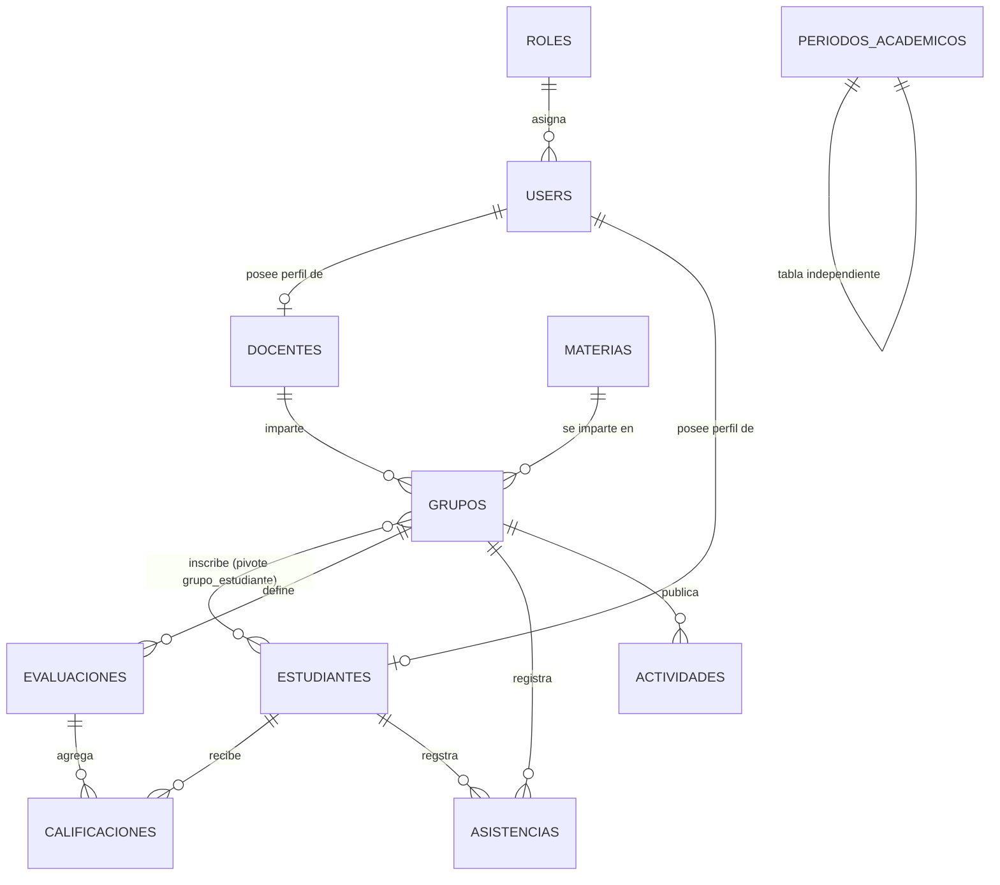

# Modelo de Base de Datos

> Documentación generada a partir de las migraciones de `database/migrations/` y los modelos de `app/Models/`.
> Última actualización: 2026-10-03.

## Contenido

1. [Visión general y diagrama](#1-visión-general-y-diagrama)
2. [Tablas principales del dominio](#2-tablas-principales-del-dominio)
3. [Tablas auxiliares de Laravel](#3-tablas-auxiliares-de-laravel)
4. [Claves e índices](#4-claves-e-índices)
5. [Relaciones Eloquent](#5-relaciones-eloquent)
6. [Detalle de los modelos](#6-detalle-de-los-modelos)
7. [Historial de migraciones y notas](#7-historial-de-migraciones-y-notas)

---

## 1. Visión general y diagrama

El portal de estudio es una aplicación Laravel con base de datos relacional. El dominio se organiza en torno a:

- **Usuarios y roles**: autenticación y autorización de cuentas.
- **Perfiles**: cada usuario puede ser docente (`docentes`) o estudiante (`estudiantes`), con perfil opcional.
- **Estructura académica**: `materias` que se imparten en `grupos` (identificados por semestre y año).
- **Vida del grupo**: inscripciones de estudiantes (tabla pivote `grupo_estudiante`), `evaluaciones` con `calificaciones`, `asistencias` y `actividades`.
- **Periodos académicos**: tabla `periodos_academicos` independiente (sin relación con `grupos`).

### Diagrama entidad-relación

> Nota: `periodos_academicos` no tiene llaves foráneas ni modelos con relaciones; los `grupos` repiten sus propias columnas `semestre` y `anio`.

---

## 2. Tablas principales del dominio

Leyenda de tipos (definidos en Laravel → tipo físico en MySQL):

| Tipo Laravel | Tipo físico (MySQL) |
|---|---|
| `id()` | `BIGINT UNSIGNED AUTO_INCREMENT` |
| `string` | `VARCHAR(255)` |
| `string(n)` | `VARCHAR(n)` |
| `date` | `DATE` |
| `time` | `TIME` |
| `timestamp` / `timestamps()` | `DATETIME` (`created_at`, `updated_at`) |
| `boolean` | `TINYINT(1)` |
| `text` | `TEXT` |
| `decimal(p,d)` | `DECIMAL(p,d)` |
| `enum(...)` | `ENUM(...)` |
| `foreignId` | `BIGINT UNSIGNED` (con restricción de FK) |

### 2.1 `users`

| Columna | Tipo | Restricciones / notas |
|---|---|---|
| `id` | `id()` | Clave primaria |
| `name` | `string` | NO NULL |
| `email` | `string` | UNIQUE, NO NULL |
| `email_verified_at` | `timestamp` | NULLABLE |
| `password` | `string` | NO NULL |
| `remember_token` | `string` | NULLABLE |
| `role_id` | `foreignId` | FK → `roles.id`, NO NULL |
| `created_at`, `updated_at` | `timestamps` | |

### 2.2 `roles`

| Columna | Tipo | Restricciones / notas |
|---|---|---|
| `id` | `id()` | Clave primaria |
| `nombre` | `string` | UNIQUE |
| `created_at`, `updated_at` | `timestamps` | |

### 2.3 `materias`

| Columna | Tipo | Restricciones / notas |
|---|---|---|
| `id` | `id()` | Clave primaria |
| `nombre` | `string` | NO NULL |
| `created_at`, `updated_at` | `timestamps` | |

### 2.4 `docentes`

| Columna | Tipo | Restricciones / notas |
|---|---|---|
| `id` | `id()` | Clave primaria |
| `user_id` | `foreignId` | FK → `users.id`, UNIQUE |
| `telefono` | `string` | NULLABLE |
| `created_at`, `updated_at` | `timestamps` | |

### 2.5 `estudiantes`

| Columna | Tipo | Restricciones / notas |
|---|---|---|
| `id` | `id()` | Clave primaria |
| `user_id` | `foreignId` | FK → `users.id`, UNIQUE |
| `telefono` | `string` | NULLABLE |
| `carrera` | `string` | NULLABLE |
| `created_at`, `updated_at` | `timestamps` | |

### 2.6 `grupos`

| Columna | Tipo | Restricciones / notas |
|---|---|---|
| `id` | `id()` | Clave primaria |
| `materia_id` | `foreignId` | FK → `materias.id` |
| `docente_id` | `foreignId` | FK → `docentes.id` |
| `semestre` | `unsignedTinyInteger` | 1–255 |
| `anio` | `unsignedSmallInteger` | 0–65535 |
| `fecha_creacion` | `date` | NO NULL |
| `hora_inicio` | `time` | NULLABLE (agregada en 2026-09-10) |
| `hora_fin` | `time` | NULLABLE (agregada en 2026-09-10) |
| `created_at`, `updated_at` | `timestamps` | |

### 2.7 `grupo_estudiante` (tabla pivote)

| Columna | Tipo | Restricciones / notas |
|---|---|---|
| `id` | `id()` | Clave primaria |
| `grupo_id` | `foreignId` | FK → `grupos.id`, `ON DELETE CASCADE` |
| `estudiante_id` | `foreignId` | FK → `estudiantes.id`, `ON DELETE CASCADE` |
| `created_at`, `updated_at` | `timestamps` | |
| — | — | UNIQUE (`grupo_id`, `estudiante_id`): un estudiante solo puede inscribirse una vez por grupo |

### 2.8 `evaluaciones`

| Columna | Tipo | Restricciones / notas |
|---|---|---|
| `id` | `id()` | Clave primaria |
| `grupo_id` | `foreignId` | FK → `grupos.id`, `ON DELETE CASCADE` |
| `nombre` | `string` | NO NULL |
| `tipo` | `enum` | `('parcial', 'asistencia_final', 'personalizada')` |
| `porcentaje` | `decimal(5,2)` | NULLABLE |
| `fecha` | `date` | NULLABLE |
| `orden` | `integer` | DEFAULT 0 (agregada en 2026-08-21) |
| `created_at`, `updated_at` | `timestamps` | |

> Ver [nota 7.1](#7-historial-de-migraciones-y-notas): esta tabla tuvo tres intentos de migración; el esquema efectivo es el de 2026-08-13 más la columna `orden`.

### 2.9 `calificaciones`

| Columna | Tipo | Restricciones / notas |
|---|---|---|
| `id` | `id()` | Clave primaria |
| `evaluacion_id` | `foreignId` | FK → `evaluaciones.id`, `ON DELETE CASCADE` |
| `estudiante_id` | `foreignId` | FK → `estudiantes.id`, `ON DELETE CASCADE` |
| `nota` | `decimal(4,2)` | NULLABLE |
| `created_at`, `updated_at` | `timestamps` | |
| — | — | UNIQUE (`evaluacion_id`, `estudiante_id`): una sola nota por estudiante y evaluación |

### 2.10 `asistencias`

| Columna | Tipo | Restricciones / notas |
|---|---|---|
| `id` | `id()` | Clave primaria |
| `grupo_id` | `foreignId` | FK → `grupos.id`, `ON DELETE CASCADE` |
| `estudiante_id` | `foreignId` | FK → `estudiantes.id`, `ON DELETE CASCADE` |
| `fecha` | `date` | NO NULL |
| `presente` | `string(20)` | DEFAULT `'presente'`; valores esperados: `presente`, `ausente`, `excusa`, `tarde` (los aceptados por `AsistenciasService::guardarAsistencias()`; la observación solo aplica a `excusa` y `tarde`) |
| `observacion` | `text` | NULLABLE (agregada en 2026-09-03) |
| `created_at`, `updated_at` | `timestamps` | |
| — | — | UNIQUE (`grupo_id`, `estudiante_id`, `fecha`): una asistencia por estudiante, grupo y fecha |

### 2.11 `periodos_academicos`

| Columna | Tipo | Restricciones / notas |
|---|---|---|
| `id` | `id()` | Clave primaria |
| `semestre` | `unsignedTinyInteger` | NO NULL |
| `anio` | `unsignedSmallInteger` | NO NULL |
| `activo` | `boolean` | DEFAULT `false` |
| `created_at`, `updated_at` | `timestamps` | |
| — | — | UNIQUE (`semestre`, `anio`) |

### 2.12 `actividades`

| Columna | Tipo | Restricciones / notas |
|---|---|---|
| `id` | `id()` | Clave primaria |
| `grupo_id` | `foreignId` | FK → `grupos.id`, `ON DELETE CASCADE` |
| `tipo` | `string(30)` | NO NULL; texto libre (p. ej., `taller`, `tarea`, `guía`). Contrato de la aplicación: se guarda normalizado a minúsculas (`mb_strtolower` en `GrupoActividades`) y se compara de forma insensible a mayúsculas (conteo de talleres del dashboard docente) |
| `titulo` | `string` | NO NULL |
| `descripcion` | `text` | NULLABLE |
| `fecha_limite` | `date` | NO NULL |
| `hora_limite` | `time` | NO NULL |
| `archivo` | `string` | NULLABLE (agregada en 2026-09-15) |
| `created_at`, `updated_at` | `timestamps` | |

---

## 3. Tablas auxiliares de Laravel

Tablas creadas por las migraciones base de Laravel (infraestructura, no negocio):

| Tabla | Columnas | Claves / índices |
|---|---|---|
| `password_reset_tokens` | `email` (PK), `token`, `created_at` (NULLABLE) | PK: `email` |
| `sessions` | `id` (string), `user_id` (NULLABLE), `ip_address` (string 45, NULLABLE), `user_agent` (text, NULLABLE), `payload` (longText), `last_activity` (integer) | PK: `id`; índices en `user_id` y `last_activity` |
| `cache` | `key` (string), `value` (mediumText), `expiration` (integer) | PK: `key`; índice en `expiration` |
| `cache_locks` | `key` (string), `owner` (string), `expiration` (integer) | PK: `key`; índice en `expiration` |
| `jobs` | `id`, `queue` (string), `payload` (longText), `attempts` (unsignedTinyInteger), `reserved_at` (NULLABLE), `available_at`, `created_at` | PK: `id`; índice en `queue` |
| `job_batches` | `id` (string), `name`, `total_jobs`, `pending_jobs`, `failed_jobs`, `failed_job_ids`, `options` (NULLABLE), `cancelled_at` (NULLABLE), `created_at`, `finished_at` (NULLABLE) | PK: `id` |
| `failed_jobs` | `id`, `uuid` (UNIQUE), `connection`, `queue`, `payload`, `exception`, `failed_at` (default CURRENT_TIMESTAMP) | PK: `id`; único en `uuid` |

---

## 4. Claves e índices

### 4.1 Claves primarias

Todas las tablas del dominio usan `id` BIGINT autoincremental como PK, salvo:

- `password_reset_tokens` → PK: `email`
- `sessions` → PK: `id` (string)
- `cache`, `cache_locks` → PK: `key` (string)
- `job_batches` → PK: `id` (string)

### 4.2 Claves foráneas

| Tabla | Columna | Referencia | Comportamiento |
|---|---|---|---|
| `users` | `role_id` | `roles.id` | RESTRICT (por defecto) |
| `docentes` | `user_id` | `users.id` | RESTRICT, UNIQUE |
| `estudiantes` | `user_id` | `users.id` | RESTRICT, UNIQUE |
| `grupos` | `materia_id` | `materias.id` | RESTRICT |
| `grupos` | `docente_id` | `docentes.id` | RESTRICT |
| `grupo_estudiante` | `grupo_id` | `grupos.id` | **CASCADE** |
| `grupo_estudiante` | `estudiante_id` | `estudiantes.id` | **CASCADE** |
| `evaluaciones` | `grupo_id` | `grupos.id` | **CASCADE** |
| `calificaciones` | `evaluacion_id` | `evaluaciones.id` | **CASCADE** |
| `calificaciones` | `estudiante_id` | `estudiantes.id` | **CASCADE** |
| `asistencias` | `grupo_id` | `grupos.id` | **CASCADE** |
| `asistencias` | `estudiante_id` | `estudiantes.id` | **CASCADE** |
| `actividades` | `grupo_id` | `grupos.id` | **CASCADE** |

> Nota: `sessions.user_id` tiene índice pero **no** declara restricción foránea.
> Efecto práctico del CASCADE: borrar un `grupo` elimina automáticamente sus inscripciones, evaluaciones, asistencias y actividades; borrar un `estudiante` borra sus inscripciones, calificaciones y asistencias; borrar una `evaluacion` borra sus `calificaciones`.

### 4.3 Índices únicos (multi-columna y de columna)

| Tabla | Columnas |
|---|---|
| `users` | `email` |
| `roles` | `nombre` |
| `docentes` | `user_id` |
| `estudiantes` | `user_id` |
| `grupo_estudiante` | (`grupo_id`, `estudiante_id`) |
| `calificaciones` | (`evaluacion_id`, `estudiante_id`) |
| `asistencias` | (`grupo_id`, `estudiante_id`, `fecha`) |
| `periodos_academicos` | (`semestre`, `anio`) |
| `failed_jobs` | `uuid` |

PostgreSQL no crea automáticamente índices sobre las columnas de claves foráneas. Los índices necesarios deben declararse explícitamente cuando las consultas y relaciones del dominio lo requieran.

---

## 5. Reliciones Eloquent

Relaciones definidas en `app/Models/`:

| Modelo | Método | Tipo | Contraparte | Detalle |
|---|---|---|---|---|
| `User` | `role()` | `belongsTo` | `Role` | Vía `users.role_id` |
| `User` | `docente()` | `hasOne` | `Docente` | Vía `docentes.user_id` |
| `User` | `estudiante()` | `hasOne` | `Estudiante` | Vía `estudiantes.user_id` |
| `Role` | `users()` | `hasMany` | `User` | |
| `Docente` | `user()` | `belongsTo` | `User` | |
| `Docente` | `grupos()` | `hasMany` | `Grupo` | |
| `Estudiante` | `user()` | `belongsTo` | `User` | |
| `Estudiante` | `grupos()` | `belongsToMany` | `Grupo` | Pivote: `grupo_estudiante` |
| `Estudiante` | `calificaciones()` | `hasMany` | `Calificacion` | |
| `Materia` | `grupos()` | `hasMany` | `Grupo` | |
| `Grupo` | `materia()` | `belongsTo` | `Materia` | |
| `Grupo` | `docente()` | `belongsTo` | `Docente` | |
| `Grupo` | `estudiantes()` | `belongsToMany` | `Estudiante` | Pivote: `grupo_estudiante` |
| `Grupo` | `evaluaciones()` | `hasMany` | `Evaluacion` | |
| `Grupo` | `asistencias()` | `hasMany` | `Asistencia` | |
| `Grupo` | `actividades()` | `hasMany` | `Actividad` | |
| `Evaluacion` | `grupo()` | `belongsTo` | `Grupo` | |
| `Evaluacion` | `calificaciones()` | `hasMany` | `Calificacion` | |
| `Calificacion` | `evaluacion()` | `belongsTo` | `Evaluacion` | |
| `Calificacion` | `estudiante()` | `belongsTo` | `Estudiante` | |
| `Asistencia` | `grupo()` | `belongsTo` | `Grupo` | |
| `Asistencia` | `estudiante()` | `belongsTo` | `Estudiante` | |
| `Actividad` | `grupo()` | `belongsTo` | `Grupo` | |
| `PeriodoAcademico` | — | — | — | Sin relaciones definidas |

### Observaciones de diseño

- La única relación **muchos a muchos** es `Grupo ↔ Estudiante` mediante la pivote `grupo_estudiante` (con timestamps).
- Las relaciones están definidas solo en una dirección en varios casos; por ejemplo no existen los inversos `Estudiante::asistencias()`, `Estudiante::actividades()`, `Materia::estudiantes()`, etc.
- `User` puede tener a la vez un perfil `Docente` y uno `Estudiante` (ambas `hasOne`, la FK en cada perfil es UNIQUE).
- El modelo `Materia` incluye el helper estático `normalizarNombre()` (trim, espacios simples, minúsculas UTF-8 con primera letra en mayúscula).
- El modelo `Estudiante` incluye `notaFinal()`: suma de `calificacion->nota × (evaluacion->porcentaje / 100)`.

---

## 6. Detalle de los modelos

| Modelo | Tabla (`$table`) | `fillable` | Casts |
|---|---|---|---|
| `User` | `users` (por convención) | `name`, `email`, `password`, `role_id` | `email_verified_at` → datetime, `password` → hashed |
| `Role` | `roles` (por convención) | `nombre` | — |
| `Materia` | `materias` (por convención) | `nombre` | — |
| `Docente` | `docentes` (por convención) | `user_id`, `telefono` | — |
| `Estudiante` | `estudiantes` (por convención) | `user_id`, `telefono`, `carrera` | — |
| `Grupo` | `grupos` (por convención) | `materia_id`, `docente_id`, `semestre`, `anio`, `fecha_creacion`, `hora_inicio`, `hora_fin` | `fecha_creacion` → date, `semestre` → integer, `anio` → integer |
| `Evaluacion` | `evaluaciones` **(explicito)** | `grupo_id`, `nombre`, `porcentaje`, `tipo`, `fecha` | — |
| `Calificacion` | `calificaciones` **(explicito)** | `evaluacion_id`, `estudiante_id`, `nota` | — |
| `Asistencia` | `asistencias` (por convención) | `grupo_id`, `estudiante_id`, `fecha`, `presente`, `observacion` | `fecha` → date |
| `PeriodoAcademico` | `periodos_academicos` **(explicito)** | `semestre`, `anio`, `activo` | `semestre` → integer, `anio` → integer, `activo` → boolean |
| `Actividad` | `actividades` **(explicito)** | `grupo_id`, `tipo`, `titulo`, `descripcion`, `fecha_limite`, `hora_limite`, `archivo` | `fecha_limite` → date |

> Los modelos `Evaluacion`, `Calificacion` y `Actividad` definen `$table` explícitamente porque la pluralización por convención de Laravel produciría `evaluations` / `califications` (plural inglés) en lugar de `evaluaciones` / `calificaciones`.
> `User` oculta `password` y `remember_token` en la serialización y usa `HasFactory` y `Notifiable`.

---

## 7. Historial de migraciones y notas

### 7.1 Notas sobre migraciones iterativas

La carpeta contiene varias migraciones que intentan crear/modificar las mismas tablas (resultado de un desarrollo iterativo). En una base de datos nueva, las migraciones se ejecutan en orden cronológico de sus nombres y el resultado efectivo es:

- **`evaluaciones`**: la primera creación (2026-08-13, con `tipo` ENUM y `fecha`) es la que aplica. Las migraciones de 2026-08-21 (`crear_tablas_evaluaciones_y_calificaciones` y `create_evaluaciones_table`) están protegidas con `Schema::hasTable` y, al existir la tabla, solo la segunda agrega la columna `orden` (si no existe). `remover_check_constraint_evaluaciones_tipo` solo actúa en PostgreSQL (elimina el constraint `evaluaciones_tipo_check` derivado del ENUM). **El esquema documentado en la sección 2.8 refleja este estado efectivo.**
- **`asistencias`**: las migraciones de 2026-08-13 y 2026-08-20 que alteran la columna `presente` solo actúan si ya existía una tabla previa (singular o plural); la definición definitiva es la de 2026-08-20 (`crear_tabla_asistencias_definitiva`), que solo crea la tabla si no existe. El campo `presente` es `VARCHAR(20)` con los valores `presente` / `ausente` / `excusa` / `tarde` (el servicio de asistencias acepta los cuatro estados; el comentario original de la migración solo mencionaba tres).
- Si una base de datos de producción se creó antes de alguna de estas migraciones, su esquema puede diferir del documentado; conviene verificar con `SHOW CREATE TABLE`.

### 7.2 Lista de migraciones

| Migración | Acción |
|---|---|
| `0001_01_01_000000_create_users_table` | Crea `users`, `password_reset_tokens`, `sessions` |
| `0001_01_01_000001_create_cache_table` | Crea `cache`, `cache_locks` |
| `0001_01_01_000002_create_jobs_table` | Crea `jobs`, `job_batches`, `failed_jobs` |
| `2026_08_10_161224_create_roles_table` | Crea `roles` |
| `2026_08_10_164723_add_role_id_to_users_table` | Agrega `users.role_id` FK → `roles` |
| `2026_08_13_153111_create_materias_table` | Crea `materias` |
| `2026_08_13_153926_create_docentes_table` | Crea `docentes` |
| `2026_08_13_154430_create_estudiantes_table` | Crea `estudiantes` |
| `2026_08_13_155103_create_grupos_table` | Crea `grupos` |
| `2026_08_13_155456_create_grupo_estudiante_table` | Crea pivote `grupo_estudiante` |
| `2026_08_13_155815_create_evaluacions_table` | Crea `evaluaciones` (versión inicial con ENUM `tipo` y `fecha`) |
| `2026_08_13_160527_create_calificaciones_table` | Crea `calificaciones` |
| `2026_08_13_160710_create_asistencias_table` | Convierte `presente` a VARCHAR(20) si existía tabla `asistencia(s)` previa |
| `2026_08_20_184415_actualizar_campo_presente_en_asistencia_table` | No-op (sin acciones) |
| `2026_08_20_184753_cambiar_columna_presente_a_texto_en_asistencia` | Convierte `presente` a VARCHAR(20) si existe tabla previa |
| `2026_08_20_185107_crear_tabla_asistencias_definitiva` | Crea `asistencias` si no existe (única `grupo_id`, `estudiante_id`, `fecha`) |
| `2026_08_21_155656_crear_tablas_evaluaciones_y_calificaciones` | Crea `evaluaciones`/`calificaciones` si no existen (definición alternativa) |
| `2026_08_21_162709_create_evaluaciones_table` | Crea `evaluaciones` si no existe; si existe, agrega `orden` |
| `2026_08_21_162946_remover_check_constraint_evaluaciones_tipo` | Elimina constraint CHECK del ENUM `tipo` (solo PostgreSQL) |
| `2026_09_03_163436_add_observacion_to_asistencias_table` | Agrega `asistencias.observacion` TEXT NULLABLE |
| `2026_09_10_165549_add_horario_to_grupos_table` | Agrega `grupos.hora_inicio` y `grupos.hora_fin` TIME NULLABLE |
| `2026_09_10_174931_create_periodos_academicos_table` | Crea `periodos_academicos` |
| `2026_09_13_162848_create_actividads_table` | Crea `actividades` |
| `2026_09_15_142022_add_archivo_to_actividades_table` | Agrega `actividades.archivo` VARCHAR(255) NULLABLE |
